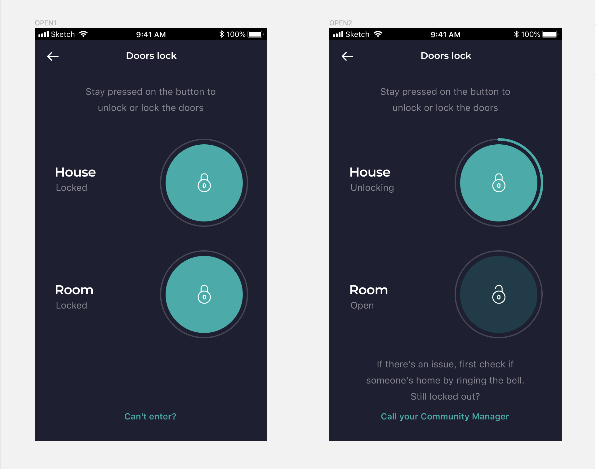

👋 Hey, glad you made it! Let’s roll up our sleeves a bit. Hopefully you find this challenge fun, as it’s a first taste of the kind of work we will do together.

# Mindset

The purpose of this exercise is to test out your skills on a real-life use case. As you’re interviewing for a full-stack position, it naturally spans over a little back-end as well as mobile work.

The challenge aims at making sure that we’ve got a clear understanding of your current JS level. **It’s important that you do your best** given the time constraints so we can transparently assess whether you’re technically a good fit for the job.

There is **no perfect answer** to the challenge, and we’ll be pleased to hear how and why you came to the solution you propose. There are however wrong answers (the ones that do not meet the specifications), so please list any assumptions that you made or try and clarify them with us early on. Just as for our future collaboration, you should not be working in isolation.

We invite you to take enough time to provide a **well-crafted solution**. We love structure, clear code, tests, explicitly named variables and functions, and simple architectures to name a few. Do review best practices online if you wish, and look for other solutions to similar problems too. It would be **really cool if you could also surprise us with things you teach us** that we did not know!

This challenge is only the technical part, keep in mind we value the **human/cultural fit** just as much, if not more.

Best of luck!

# Challenge

Your mission is to create a **standalone React Native app** and improve its **Node back-end to handle the locks of our houses for our property managers.** They routinely need to be able to access the houses and rooms of our members to fix incidents, and we’d like to make it easier for them. We also log their comings and goings; privacy is important to our members and this way we can provide them with a list of exactly when we entered their rooms.

We provide **specifications only for the interface**, it is up to you to define the full implementation of your solution. You are free to do anything you want as long as it meets the specifications. Just, please use ES6. We generally use [react-native-cli](https://github.com/react-native-community/cli) but, in the spirit of speeding things up, feel free to go with [Expo](https://expo.io/) or your preferred platform. Similarly, our production app uses [Redux Saga](https://github.com/redux-saga/redux-saga), [React Navigation](https://reactnavigation.org/docs/en/getting-started.html), and [Emotion](https://emotion.sh/) but you can use what you deem best to meet the objective in the time constraint.

We strongly suggest that you write both **unit** and **integration tests** to test the code you produce. For this purpose we usually work with `mocha` and `chai`.

# Specifications

Our current mobile app has an integration with our smart locks that passes through the back-end. We’ll recycle the view, with a couple of needed twists.

These are the modules you can find in the repo, a short description follows:

- [smart-lock-mock](#smart-lock-mock)
- [back-end](#back-end)
- [mobile](#mobile)

## smart-lock-mock

**Nothing to see here**. Please keep this service unmodified.

To keep it realistic, we have **mocked the smart lock 3rd-party API** that in real life would be responsible for opening and closing the locks. Its requests take a couple of seconds to complete, and to make it fun, it serves random HTTP response codes to force user testing of the different cases.

About 20% of the requests will return an error message.

## back-end

**Freedom!** You are free to change everything (source, dependencies, etc.) as long as the endpoint is backwards compatible when you hand in the solution. Keep in mind that we chose the tech stack on purpose, but if you want to refactor "the whole damn thing", ...go ahead. This will "earn" you an interesting discussion in the review.

**Watch out for bugs**. There are two parts of the provided codebase which are problematic on purpose. They will work (you can complete the challenge without touching them) but if you stumble upon one of those, feel free to fix them (in a separate commit 😉).

**Simple is better.** Please keep the following points in mind:

- Assume the **user has been authenticated** so no need to implement JWT auth, extra points if you manage to do it though.
- **No persistence layer**, the data and initial state of the locks are stored in a JSON file stored on `/back-end/storage/houses.json`.

## mobile

**Anybody in there?** The folder is empty. Here is where the code of the **React Native app** that you need to create goes.

**Mind the App.** On the [Figma file below](https://www.figma.com/file/Ic8zA4IucNWmdFa0oNgLYHZy?node-id=0:1445) you can find the design implemented in the current application. You can replicate as much as you want but keep in mind we won’t be judging your ability to match it pixel for pixel. It is presented here as an inspiration of what’s already available in our design library, so you don’t have to start from scratch. Just as you would on a regular day on the job.


[View the design in Figma](https://www.figma.com/file/Ic8zA4IucNWmdFa0oNgLYHZy?node-id=0:1445)

Please keep the following requirements in mind:

1. Implement a component to **switch between houses**. Since you’re a property manager you automatically have access to all the rooms in a house.
2. The current design only allows for exactly one of each type of lock: 1 house door and 1 room door. It turns out we sometimes have more than one of each. 
    - Adapt the UX of the visuals so that we can **handle a discrete number of locks**, each with a specific label and always either of the “house” or “room” category (*e.g.* room door, room locker, house front door, house back door).
    - Add a simple favorites system that lets the user have quick access to a reduced number of locks. This is a good place to showcase your mastery of React Native: think gestures, smooth transitions,... we leave it up to you.
3. **Handle errors gracefully**, the UI can be optimistic and reflect the target state but should update accordingly if there was an issue during the request. Also, the user needs to be somehow notified in 'plain english' that something happened.
4. You might have guessed from the Figma designs they come with animations (the lock button has a circular green bar that fills up as the lock locks/unlocks). Complete fidelity is out of scope here but please **add at lease one visual animation**.
5. **State of the locks can be updated out of our scope** i.e. offline (someone opens the door manually) or from a different device. Therefore, we need the following:
    - The user should be able to know at any given time the current state of the lock.
    - The user should receive a push notification when a lock has been locked or unlocked from another client.
    - The number of requests monitoring this back to the **back-end** API should be kept as low as possible.
6. Because opening a house door is sensitive, we need **some kind of biometrics authentication**. Please implement some sort of fingerprint, touchId, or faceId upon opening the app.

# Practicalities

Please **clone our GitHub repository** then commit your work on **your own private repo** and give us access so we can review your work. You have **1 week** as of the moment you've received the challenge to send us a working version. We allow for a lot of time as we don't believe you'll be working on it full-time throughout the week and it allows for potential communication to clear things out. We expect that we can test your challenge by running the following commands:

```bash
npm install
npm run test
npm start
```

It is up to you to decide what you put in these tests, but please remember that we love tests and there should be at least one.

Both **back-end** and **smart-lock-mock** have their own **README** files that we suggest you to read, similarly we would like you to **include a README file** with short documentation/presentation of your code and the instructions to run it locally, spinning up the server and launching the mobile app simulator (we will be testing on iOS). It should be sufficient for us to test it out and understand your rationale behind the choices you've made.

**We'll review your submission in the week after we receive it** and schedule a call so we can discuss your implementation together.

The rest is up to you, we're excited to see what you'll come up with!